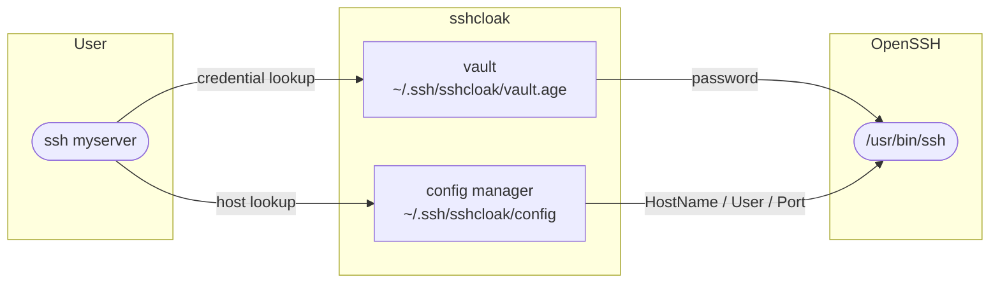

# sshcloak

**sshcloak** is a transparent SSH credential manager for Linux and macOS.  
It keeps your `~/.ssh/config` exactly as you wrote it while silently injecting passwords and managing host entries through a dedicated include file backed by an age-encrypted vault.

```
ssh myserver
```

That's it. No password prompt. No proprietary config. No subscription.

---

## Overview



### Key properties

| Property | Detail |
|---|---|
| **No root required** | Everything lives under `~/.ssh/sshcloak/` |
| **Non-destructive** | Only one `Include` line is ever appended to `~/.ssh/config` |
| **Encrypted at rest** | Vault uses [age](https://age-encryption.org/) with scrypt passphrase derivation |
| **Zero dependencies at runtime** | Single statically-linked binary |
| **Standard SSH config** | Host entries are valid `ssh_config(5)` — readable by any tool |

---

## Requirements

### Runtime

| Requirement | Version |
|---|---|
| Linux or macOS | — |
| OpenSSH client (`ssh`) | ≥ 7.3 (for `Include` directive support) |

### Build

| Requirement | Version |
|---|---|
| Go | ≥ 1.22 |

### Optional (for docs)

| Requirement | Version |
|---|---|
| Python | ≥ 3.9 |
| MkDocs + Material | see `docs/requirements.txt` |

---

## Project layout

```
sshcloak/
├── cmd/
│   ├── main.go                     # entry point
│   └── internal/cli/
│       ├── root.go                 # root command, flag wiring
│       ├── host/                   # sshcloak host *
│       ├── vault/                  # sshcloak vault *
│       └── password/               # sshcloak password *
├── internal/
│   ├── config/                     # SSH config parser + CRUD manager
│   └── keyring/                    # age-encrypted vault
├── docs/                           # this documentation
├── Makefile
└── mkdocs.yml
```
