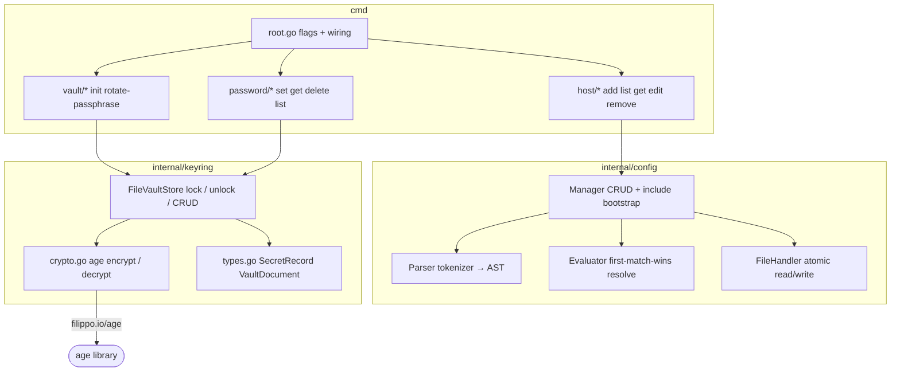
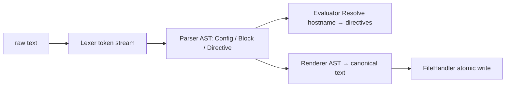
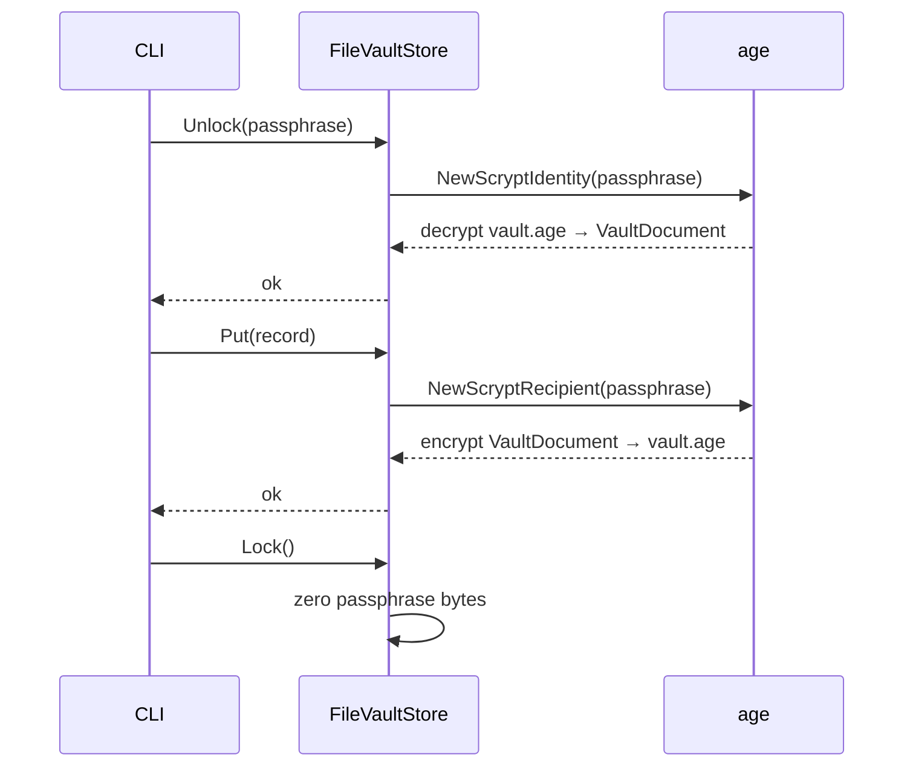
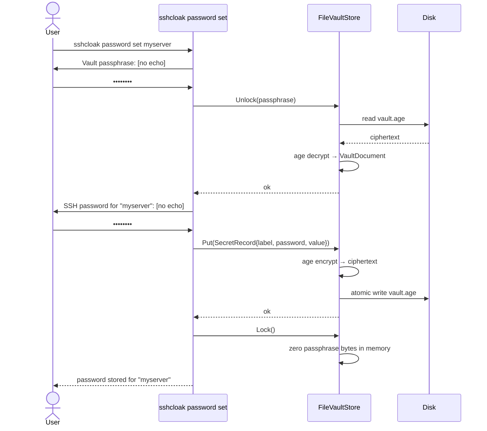

-.-# Internals

This page describes sshcloak's internal architecture for contributors and
advanced users.

---

## Component overview



---

## SSH config manager (`internal/config`)

sshcloak parses `~/.ssh/config` with a hand-written tokenizer and builds an
AST of `Host` and `Match` blocks.  It never uses an external SSH config
library so the output is always canonical and round-trips losslessly.

### Parse pipeline



### Isolation model

sshcloak appends exactly one line to `~/.ssh/config`:

```
Include ~/.ssh/sshcloak/config
```

All host CRUD operates exclusively on `~/.ssh/sshcloak/config`.  The root file
is never rewritten, only appended to (once).

### Atomic writes

All config and vault writes use the same pattern:

1. Write to a temp file in the **same directory** as the target.
2. `chmod` the temp file to the correct permissions.
3. `os.Rename` — atomic on POSIX systems.

This guarantees that a crash or power loss never produces a truncated or
partially-written file.

---

## Encrypted vault (`internal/keyring`)

### Vault format

The vault is a single YAML document encrypted with age and ASCII-armored
(PEM-style).  The plaintext structure:

```yaml
version: 1
secrets:
  "myserver\x00password":
    label: myserver
    kind: password
    value: s3cr3t!
    created_at: 2026-05-10T12:00:00Z
    updated_at: 2026-05-10T12:00:00Z
```

The map key is `label + "\x00" + kind`, which makes label+kind pairs unique
without nesting.

### Encryption



age uses scrypt with default work factors, which makes brute-force attacks
against a stolen vault file computationally expensive.

---

## Data flow: `password set`



---

## Dependency graph

| Package | External dependency | Purpose |
|---|---|---|
| `internal/keyring` | `filippo.io/age` | Passphrase-based encryption |
| `internal/keyring` | `go.yaml.in/yaml/v3` | Vault serialization |
| `cmd/...` | `github.com/spf13/cobra` | CLI framework |
| `cmd/...` | `golang.org/x/term` | No-echo passphrase prompting |
| `internal/config` | none | Pure Go SSH config parser |
